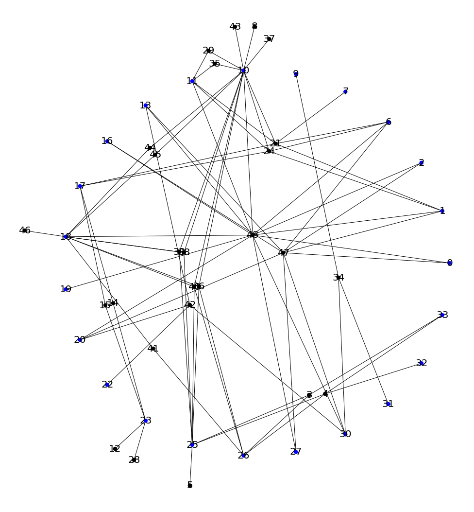
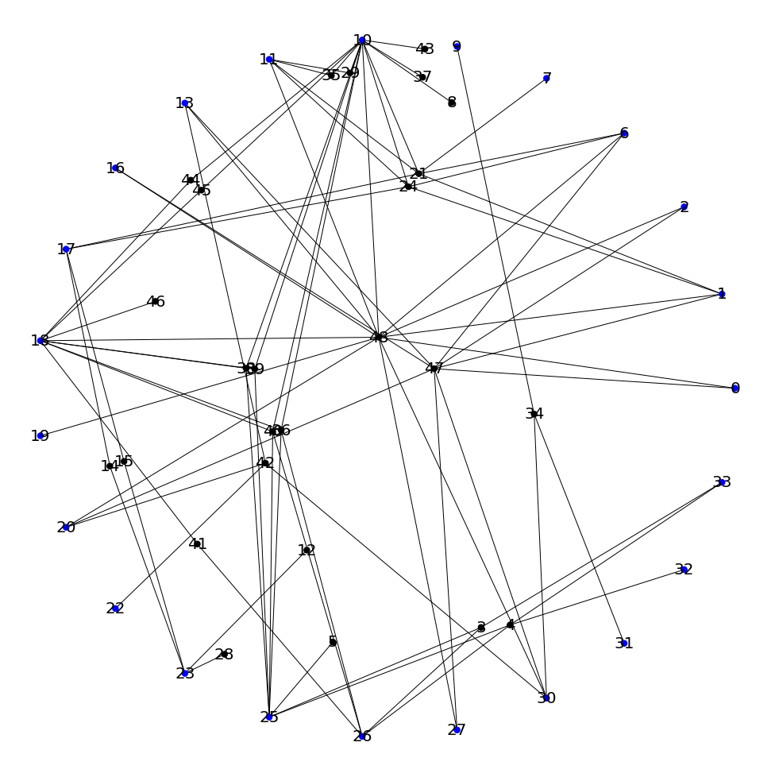
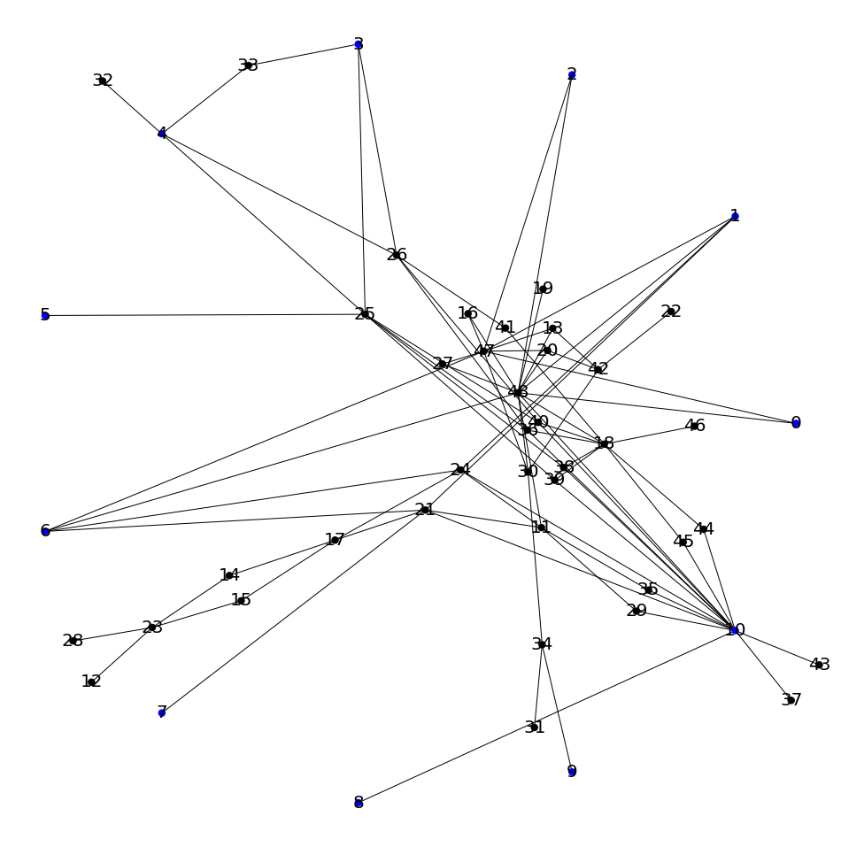

# anchored-map-layout-algorithm
> A method of drawing anchored maps for bipartite graphs
>
> the method about How to decide the order of anchor nodes from the paper ***Drawing Bipartite Graphs as Anchored Maps***， and use Fruchterman-Reingold algorithm (this part borrows from network's spring_layout，if you want to kown more , you can see the paper  ***Graph Drawing by Force-directed Placement***) to layout the free node。

There are many parameters here, you can choose tnem according to your needs，I will introduce some commonly used parameter choices here。

#### Draw basic bipartite graph

In this case,you just need to specify the source data path, don't need to modify other parameters .But the algorithm has certain requirements for the format of the data.  You can specify whether it is a member or a community through the location attribute of the node. The algorithm will treat community node  as an anchor. 

```python
json_file = './test.json'  
pos_res1 = Anchored_Map(json_file)
```



#### Restrict free node position  within the circle

Under normal circumstances, the position of the cluster linked to a single anchor point will be outside the circle，if the parameter `inner=True`, free node position are restricted  within the circle. more over, this parameter  can be used with `center` and `r`，`center`  and `r` can determine a circle. In this way you can control the position of the node more accurately.

```python
pos_res2 = Anchored_Map(json_file,inner=True) 
```



#### Specify the anchor point yourself

the parameter `anchor_nodes` is passed in an array,  you can specify those nodes as anchor points

```python
anchor_nodes = [0,1,2,3,4,5,6,7,8,9,10]
pos_res1 = Anchored_Map(json_file,anchor_nodes=anchor_nodes)
```



